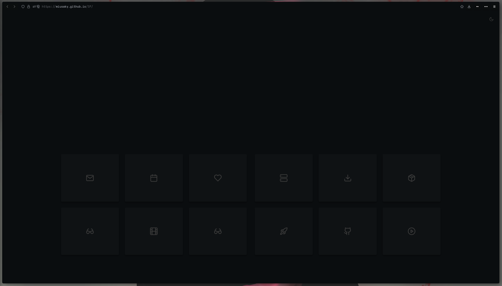

# SAGA for Firefox
A Dark theme for [Firefox](https://www.mozilla.org/en-US/firefox/new/)

## Installation
1. Clone the repository and move the chrome folder into your Firefox profile folder. 

2. Set your homepage in Firefox settings > Home > Homepage and new windows to the path of index.hmtl in the chrome/SP folder. 

## Credit
The theme is [Firefox Sweet](https://github.com/EliverLara/firefox-sweet-theme). 
The Startpage is [Tea Green](https://github.com/sadparadiseinhell/tea-green). 

## License

[MIT License](./LICENSE)

